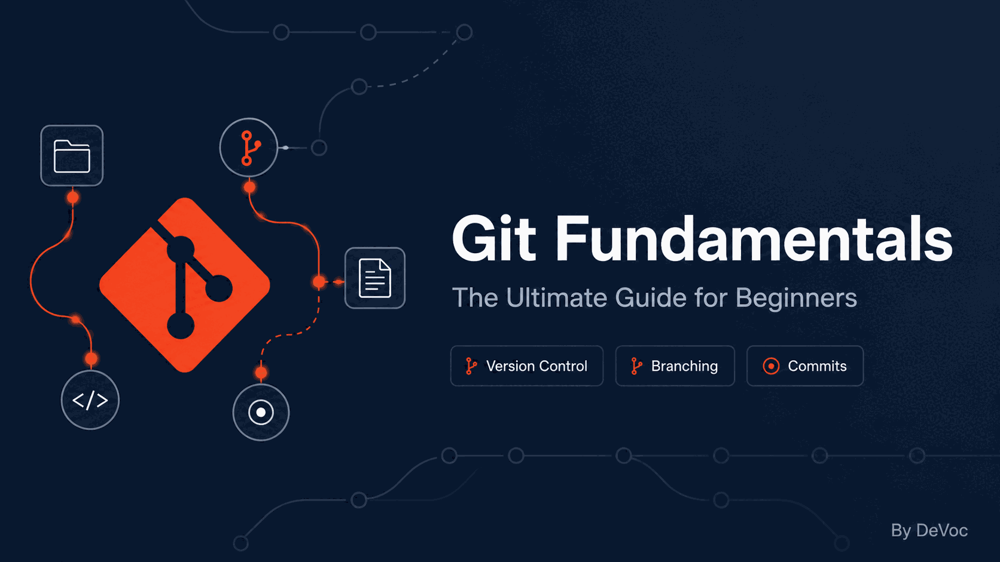
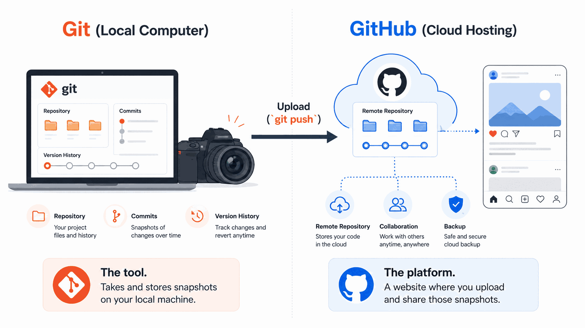
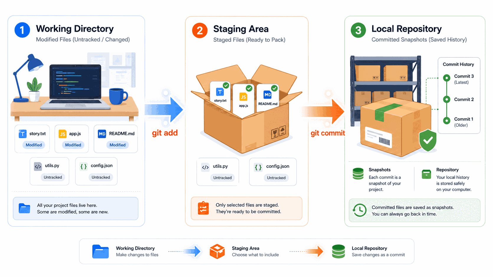
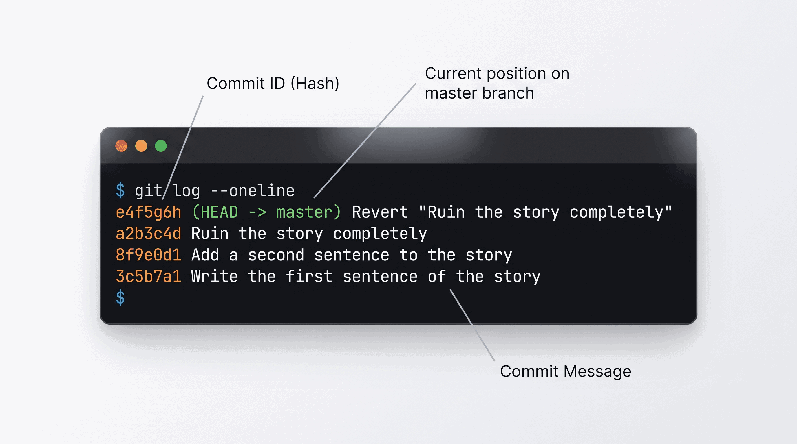
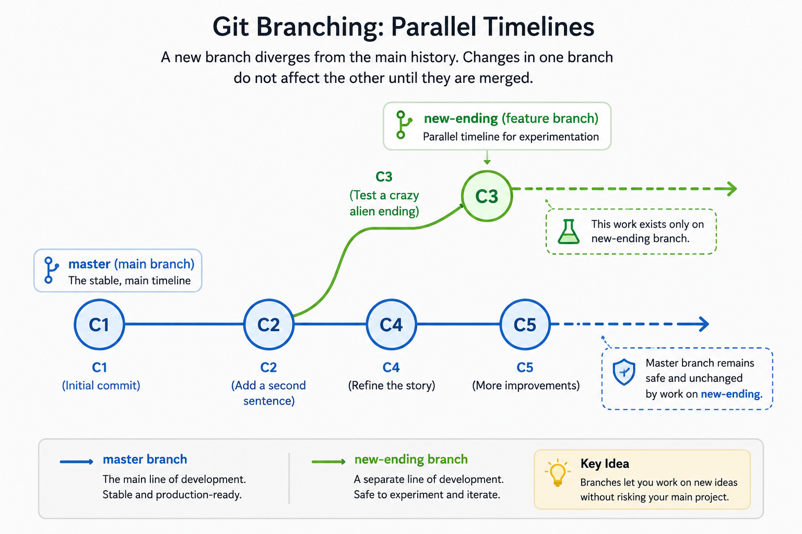
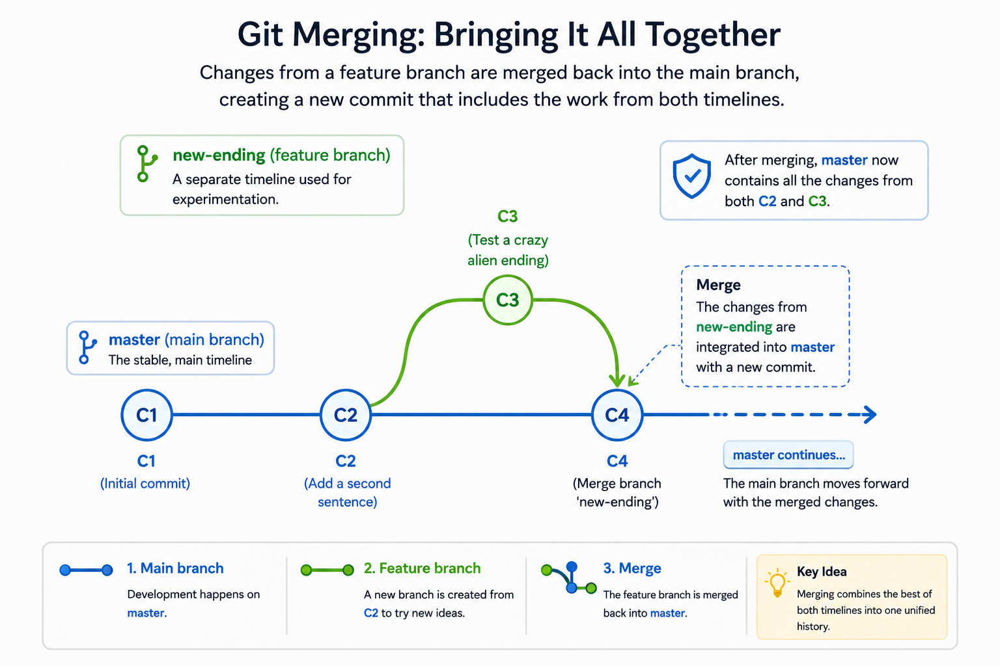

<div align="center">
  
</div>
<br>

# Git Fundamentals: The Ultimate Guide for Beginners

Version control is a cornerstone of modern software development, ensuring that changes to files are tracked, managed, and preserved over time. This guide introduces the core concepts and workflows of Git, the industry-standard version control system, through practical, hands-on exercises designed for complete beginners.

### The Big Difference: Git vs. GitHub
Before we do anything, we need to clear up a massive misconception: **Git and GitHub are not the same thing.**

* **Git** is the actual tool. It is a program installed on your computer that acts like a version history tracker (a time machine) for your project. *(Think of Git like a camera you use to take pictures).*
* **GitHub** is a website. It is simply a place on the internet where you can upload and store the work you did using Git. *(Think of GitHub like Instagram, a platform where you upload the pictures you took).*



*In this guide, we are ignoring the internet entirely. You are only learning **Git** so you can master local version control on your own machine.*

> 💡 **How to Use This Guide:** Headings marked with a computer emoji (💻) indicate hands-on steps where you will write code, run commands, or edit files yourself. Headings marked with a file emoji (📄) indicate steps where you will create a new file. Follow along step-by-step to practice using Git on your computer.

---

## 📌 Table of Contents (The Map)

1. [Chapter 1: The Vocabulary (Warehouse, Shipping Box, & Checkpoints)](#chapter-1-the-core-concepts-the-vocabulary)
2. [Chapter 2: Setting Up Your Identity (Who Are You?)](#chapter-2-setting-up-your-identity)
3. [Chapter 3: Creating Your First Save Point (Initialize & First Commit)](#chapter-3-creating-your-first-save-point)
4. [Chapter 4: Viewing History (The Version Log)](#chapter-4-viewing-history-the-version-log)
5. [Chapter 5: The Daily Workflow (Making Changes)](#chapter-5-the-daily-workflow-making-changes)
6. [Chapter 6: Keeping Things Clean (Ignoring Files)](#chapter-6-keeping-things-clean-ignoring-files)
7. [Chapter 7: Parallel Dimensions (Branches)](#chapter-7-parallel-dimensions-branches)
8. [Chapter 8: Bringing It Together (Merging & Branch Deletion)](#chapter-8-bringing-it-together-merging-branch-deletion)
9. [Chapter 9: The "Undo" Button (Reverting)](#chapter-9-the-undo-button-reverting)
10. [Conclusion: Practice Makes Permanent](#conclusion-practice-makes-permanent)
11. [Appendix: Where to Go From Here (Resources)](#appendix-where-to-go-from-here-resources)

---

## 💻 Step 0: The Setup (Windows, Mac, & Linux)

Before we start, you need two things:
1. **A Text Editor:** (Notepad on Windows, TextEdit on Mac, or a code editor like VS Code).
2. **Git Installed:** If you haven't installed it, go to [git-scm.com](https://git-scm.com/) and download it. 
   * *Windows Users:* Installing this will give you a program called **Git Bash**. We highly recommend using Git Bash or the integrated terminal inside **VS Code** (a popular text editor choice for beginners) for this tutorial instead of the standard Command Prompt.

---

## Chapter 1: The Core Concepts (The Vocabulary)



Before we type any commands, you need to understand three core concepts. Let's use a shipping analogy:

1. **The Repository (The Warehouse):** A repository, or "repo," is a normal folder that contains a hidden `.git` directory where Git stores the complete history of your project. Git does *not* actively run in the background watching your files in real-time. It only looks when you ask it to!
2. **The Staging Area (The Shipping Box):** When you make changes to files, Git doesn't save them automatically. Instead, Git can detect changes when you ask it. Moving a file to the staging area is like putting an item into a cardboard shipping box. You can still add more items or take them out before shipping.
3. **The Commit (Sealing the Box):** A commit is a snapshot of your project at that moment. Think of it like a video game checkpoint. If you fall into a pit of lava (corrupt your code), you can respawn right here. It is the equivalent of taping the shipping box shut, slapping a descriptive label on it, and putting it on the warehouse shelf.

---

## Chapter 2: Setting Up Your Identity

Before Git allows you to save anything, it needs to know who is doing the work. Open your Terminal (Mac/Linux) or Git Bash (Windows) and type these two commands. Press **Enter** after each one. 

*(You can replace the placeholder name and email with your actual ones)*:

```bash
git config --global user.name "Your Name"
git config --global user.email "example@example.com"
```

---

## Chapter 3: Creating Your First "Save Point"

Let's put the concepts from Chapter 1 into practice.

### 💻 Step 1: Create the Folder (The Warehouse)

Create a brand new folder on your computer's Desktop and name it `my-first-project`.

### 💻 Step 2: Open Your Terminal *Inside* That Folder

* **Windows:** Open the `my-first-project` folder. Right-click anywhere in the empty space inside the folder and select **"Open Git Bash here"** or **"Open in Terminal"**. (If you are using VS Code, you can also open the folder in VS Code and press ``Ctrl + ` `` to open its integrated terminal).
* **Linux:** Open the folder, right-click in the empty space, and select **"Open in Terminal"**.
* **Mac:** Open your Terminal app. Type `cd ` (type the letters c, d, and then press the spacebar). Do not press Enter yet. Click and drag your `my-first-project` folder from your Desktop directly into the Terminal window. The path will write itself. Now press **Enter**.

### 💻 Step 3: Initialize Git

Now that your terminal is looking at the right folder, tell Git to turn this normal folder into a tracked repository:

```bash
git init
```

*This command creates the hidden `.git` folder inside your project directory. Git is now officially awake and ready to log your project history.*

### 💻 Step 3.5: Check the Initial Status

Let's check the status immediately after initialization:

```bash
git status
```

*Git will report something like `On branch main` or `On branch master` (depending on your Git configuration), `No commits yet`, and `nothing to commit`. This shows your repository is empty and waiting for you to create something cool.*

### 📄 Step 4: Create a File

1. Open your text editor.
2. Write a single sentence: "This is my first time using Git."
3. Save this file directly inside your `my-first-project` folder and name it `story.txt`.

### 💻 Step 5: Check the Status

Go back to your terminal and ask Git what it sees:

```bash
git status
```

*Notice that Git says `story.txt` is "untracked" in red. It detects the file, but it is not in the shipping box (staging area) yet.*

### 💻 Step 6: Add and Commit (Box it and Seal it)

Tell Git to prepare this file to be saved:

```bash
git add story.txt
```

Now run `git status` again to see what changed:

```bash
git status
```

*You will see `story.txt` is now listed under "Changes to be committed" in green. The file is officially in the shipping box!*

Next, commit the file to create your first official save point:

```bash
git commit -m "Write the first sentence of the story"
```

> ✍️ **Why Commit Messages Matter:**
> A commit message is the label on your shipping box. It should describe *what* you changed and *why* so that you or your future teammates can understand the timeline.
> * **Bad:** `update`, `fix`, `stuff`, `temp`, `aewijfoaiwj`
> * **Good:** `Write the first sentence of the story` or `Add user login validation`
>
> Getting into the habit of writing good commit messages now will save you countless hours of confusion later.

Let's run a final status check to verify:

```bash
git status
```

*Git will report: `nothing to commit, working tree clean`. This means all your changes are safely packed away, and your warehouse is tidy.*

### 🏁 Checkpoint Recap: What You've Done So Far

Let's review what we've accomplished to keep cognitive load low:
1. **Created a Repository:** We initialized a hidden `.git` database with `git init`.
2. **Tracked a File:** We staged `story.txt` using `git add story.txt`.
3. **Created a Save Point:** We committed the staged change using `git commit -m "..."`.

---

## Chapter 4: Viewing History (The Version Log)



Why do we commit? So we can look back at the history of our project. To view a simplified, single-line list of your checkpoints, run:

```bash
git log --oneline
```

*You will see a list of your saves. The output will look something like this:*
```text
a1b2c3d Write the first sentence of the story
```
*The code `a1b2c3d` is a unique Commit ID (or hash) that Git uses to refer to that specific save point. It's like a barcode on your shipping box.*

If you want a more detailed view showing the author, date, and full email of who made the commit, run:

```bash
git log
```

*(Note: If the log takes over your screen, just press the `q` key on your keyboard to quit the log and return to the normal terminal prompt. Don't panic, it's not frozen!).*

---

## Chapter 5: The Daily Workflow (Making Changes)

Now let's practice the daily rhythm of development: modifying a file, inspecting the differences, staging the changes, and committing them.

### 💻 Step 1: Modify the File
1. Open `story.txt` in your text editor.
2. Add a second sentence: "Learning Git is actually pretty straightforward."
3. Save the file.

### 💻 Step 2: Check the Status
Before staging the change, see what Git has detected:

```bash
git status
```

*Git will report that `story.txt` has been modified, but the changes are not yet staged.*

### 💻 Step 3: View the Differences
To see exactly what changed line-by-line before staging:

```bash
git diff
```

*You will see an output showing green text with a `+` prefix indicating the lines you added, and red text with a `-` prefix if you deleted anything. Since you added a sentence, it will show as green.*

### 💻 Step 4: Stage the Changes
Add your modified file to the shipping box:

```bash
git add story.txt
```

### 💻 Step 5: View Staged Changes
To review what is in the shipping box and ready to be committed:

```bash
git diff --staged
```

*(This shows the exact line changes that have been added to the staging area and are ready for the next commit).*

### 💻 Step 6: Commit and Verify
Seal the box and create your second save point:

```bash
git commit -m "Add a second sentence to the story"
```

Let's check the status to verify the workspace is clean again:

```bash
git status
```

*Git will report `working tree clean`.*

Let's verify our updated history log:

```bash
git log --oneline
```

*You should now see two commits in your project timeline!*

---

## Chapter 6: Keeping Things Clean (Ignoring Files)

In real-world projects, you will have files you don't want Git to track. These include temporary build logs, local notes, system folders (like `.DS_Store` on macOS), or sensitive configuration files containing passwords. 

To handle this, we use a special file named `.gitignore`. It is the ultimate "ignore my messy notes" list.

> ⚠️ **Important Note:** `.gitignore` only affects untracked files. If a file is already being tracked by Git, adding it to `.gitignore` will not remove it from version control. You must untrack it first (using `git rm --cached <file>`) before Git starts ignoring it.

### 📄 Step 1: Create a Temporary File
1. Open your text editor.
2. Save a blank file named `debug.log` inside your `my-first-project` folder.

### 💻 Step 2: Observe the Untracked File
Check the status of your folder:

```bash
git status
```

*Git reports `debug.log` as an untracked file.*

### 📄 Step 3: Create a `.gitignore` File
1. Open your text editor.
2. Create a new file and write the pattern of the file(s) you want to ignore:
   ```text
   debug.log
   ```
3. Save this file inside your `my-first-project` folder as `.gitignore`. *(Make sure the filename starts with a dot and has no other extension).*

### 💻 Step 4: Verify It Is Ignored
Check the status again:

```bash
git status
```

*Notice that `debug.log` has disappeared from the list! However, `.gitignore` itself is now listed as untracked. This is because Git needs to track the `.gitignore` file so that your ignore settings are shared with other developers.*

### 💻 Step 5: Commit Your Ignore Rules
Stage and commit the `.gitignore` file:

```bash
git add .gitignore
git commit -m "Add .gitignore to exclude debug logs"
git status
```

*Your working tree is clean once again.*

---

## Chapter 7: Parallel Dimensions (Branches)



Imagine you want to try writing a controversial new ending to your story, but you are afraid it might ruin what you already have.

Git solves this with **Branches**. A branch is a safe, parallel version of your project.

Think of branches like branching timelines in a sci-fi movie. You can go fight aliens in one timeline, while your normal self is sitting at home drinking coffee in the main timeline. If you like the alien-fighting timeline, you can merge it back!

### 💻 Step 1: Create a Branch

By default, Git creates a starting branch called `master` (though some modern installations might configure it to `main`). Let's create a new branch called `new-ending` and switch to it:

```bash
git switch -c new-ending
```

*(The `-c` stands for "create". Git will create the new branch and immediately switch you to it. Note: You may see older guides use `git checkout -b new-ending`. While `checkout` still works, modern Git recommends `switch` because it is more focused).*

Let's check the status to confirm we are on the new branch:

```bash
git status
```

*Git will report: `On branch new-ending`.*

### 💻 Step 2: Experiment Safely

1. Open `story.txt` in your text editor.
2. Add a third sentence: "Suddenly, an alien spaceship appeared."
3. Save the file.
4. Go to the terminal, check status, stage, and commit the change:

```bash
git status
git add story.txt
git commit -m "Test a crazy alien ending"
git status
```

### 💻 Step 3: Switch Back

Let's switch back to your safe, original `master` branch:

```bash
git switch master
```

Verify your status:

```bash
git status
```

*Git reports `On branch master`. Open `story.txt` in your text editor. The alien sentence is completely gone! Your main timeline is safe. The alien sentence only exists in the parallel `new-ending` branch.*

---

## Chapter 8: Bringing It Together (Merging & Branch Deletion)



Let's pretend you actually really liked the alien ending, and you want to make it part of your main story. You do this by **Merging**.

### 💻 Step 1: Merge the Changes

1. Ensure you are on the `master` branch (run `git status` to verify).
2. Tell Git to merge the `new-ending` branch into your current `master` branch:

```bash
git merge new-ending
```

*Check your text editor. The alien sentence has now been successfully merged into your main `story.txt` file.*

Run status to check the repository state:

```bash
git status
```

### 💻 Step 2: Clean Up (Delete the Branch)

Once a branch has been merged and its work is complete, you no longer need the separate branch. Delete it to keep your project history clean:

```bash
git branch -d new-ending
```

*This deletes the branch safely. Git will protect your work and block deletion if you try to delete a branch containing unmerged changes.*

> ⚠️ **What About Merge Conflicts?**
> In this example, Git merged the changes automatically because they didn't conflict. Sometimes, Git cannot decide how to combine changes automatically (for example, if you edit the exact same line of the same file in two different branches). This creates a **merge conflict**, where two timelines disagree. Git will pause and ask you to choose which timeline wins. That is completely normal and is covered in more advanced guides.

---

## Chapter 9: The "Undo" Button (Reverting)

Eventually, you will make a mistake. You will commit something broken, and you will want to go back. 

This guide focuses on `git revert`, because it's the safest way to undo committed work. You'll learn `git reset` later once you're comfortable with Git. *(Unlike `revert`, `git reset` rewrites history and can delete work permanently if not used carefully; do not delete work unexpectedly).*

Instead of erasing the past, `git revert` creates a *brand new commit* that does the exact opposite of your mistake, canceling it out. This preserves your timeline and prevents data loss.

### Undoing Local Changes (Before Committing)

If you made changes to a file but haven't saved (committed) them yet, and you want to discard them to start over, you can use:

```bash
git restore story.txt
```

*This command discards any unstaged changes in the file, returning it back to the exact state of your last commit.*

Let's make a mistake on purpose and fix it.

### 💻 Step 1: Make a Mistake
1. Open `story.txt` in your text editor.
2. Add a terrible fourth sentence: "And then everyone ate a keyboard and died."
3. Save the file.
4. Go to your terminal and commit the terrible mistake:

```bash
git status
git add story.txt
git commit -m "Ruin the story completely"
git status
```

### 💻 Step 2: Find the Mistake's ID

We need to find the unique ID of the mistake commit we just made. Type this to see your history list:

```bash
git log --oneline
```

*Look at the top line. It will look something like this: `e4f5g6h Ruin the story completely`. That code (`e4f5g6h`) is your commit ID. Highlight and copy those characters.*

### 💻 Step 3: Undo the Mistake Safely

Tell Git to revert that specific commit. 

*(Note: Replace `e4f5g6h` with your actual commit ID. We add `--no-edit` so Git just handles it automatically without opening a terminal text editor called Vim, which is famously easy to enter and famously impossible for beginners to exit!)*

```bash
git revert e4f5g6h --no-edit
```

### 💻 Step 4: Verify the Fix

Open `story.txt` in your text editor. The terrible keyboard sentence is gone. 

Now, let's verify our status and log history:

```bash
git status
git log --oneline
```

*You will see that the mistake commit is still in your history, followed immediately by a new commit that says "Revert 'Ruin the story completely'". You fixed the file without breaking the timeline!*

---

## Conclusion: Practice Makes Permanent

Congratulations! You have just learned the hardest part of Git: the core mental model. You now know how to track files, save your progress, inspect changes, experiment safely in parallel dimensions, and undo mistakes without destroying your hard work. 

Git is a muscle. The only way to get comfortable with it is to use it. Make it a habit to run `git init` for every new project you start, no matter how small.

### Your Daily Cheat Sheet

These are the commands you will use 95% of the time. Keep this list handy:

* **`git status`**: What is Git seeing right now? *(Tip: Run this constantly).*
* **`git diff`**: Show line-by-line differences in your modified files before staging.
* **`git diff --staged`**: Show differences for files currently in the staging box.
* **`git restore <file>`**: Discard unstaged changes in your working directory to restore the file to the last commit.
* **`git add <file>`**: Put this specific file in the staging box.
* **`git add .`**: Put *all* changed and new files in the staging box at once.
* **`git commit -m "message"`**: Seal the box and create a new save point.
* **`git log --oneline`**: Show a quick, single-line timeline of your save points.
* **`git switch -c <branch-name>`**: Create a new parallel branch and switch to it.
* **`git switch <branch-name>`**: Switch to an existing branch (like `master`).
* **`git merge <branch-name>`**: Combine the changes from that branch into your current branch.
* **`git branch -d <branch-name>`**: Delete a branch safely after merging.

---

## Appendix: Where to Go From Here (Resources)

When you want to practice or get unstuck, these are the best free resources available:

### 1. Interactive Visual Practice
* **[Learn Git Branching](https://learngitbranching.js.org/):** An excellent Git learning tool. It is a highly visual, interactive game that walks you through branching, merging, and reverting. You type real commands and watch the nodes move in real-time.
* **[Visualizing Git](https://git-school.github.io/visualizing-git/):** A web-based sandbox where you can type Git commands and instantly see a map of what your repository looks like.

### 2. Cheat Sheets & Quick Reference
* **[GitHub's Official Git Cheat Sheet (PDF)](https://training.github.com/downloads/github-git-cheat-sheet.pdf):** A dense but highly useful one-page reference guide for almost every Git command you will ever need.
* **[Atlassian Git Tutorials](https://www.atlassian.com/git/tutorials):** Bite-sized, clear explanations of specific Git commands and concepts.

### 3. The Official Manual
* **[Pro Git Book](https://git-scm.com/book/en/v2):** The official, free book on Git. **Chapter 2 (Git Basics)** and **Chapter 3 (Git Branching)** are fantastic reading once you feel comfortable with the core concepts.

### What's Next?
Once you can confidently make commits, switch branches, and merge them locally without panicking, you are ready for the next step: **The Cloud**. 

Your next goal should be learning how to connect your local Git repository to **GitHub**. This will allow you to back up your code to the internet and collaborate with developers all over the world.

---

<div align="center">
  <br>
  
  <p>
    <b>Created and maintained by DeVoc</b><br>
    <i>Building Software. Empowering People.</i>
  </p>
  <p>
    <a href="https://www.linkedin.com/company/devocfc" target="_blank" rel="noopener noreferrer">
      
    </a>
    <a href="https://www.instagram.com/devoc.official" target="_blank" rel="noopener noreferrer">
      
    </a>
    <a href="https://devoc.bvocfarookcollege.com" target="_blank" rel="noopener noreferrer">
      
    </a>
  </p>
</div>
